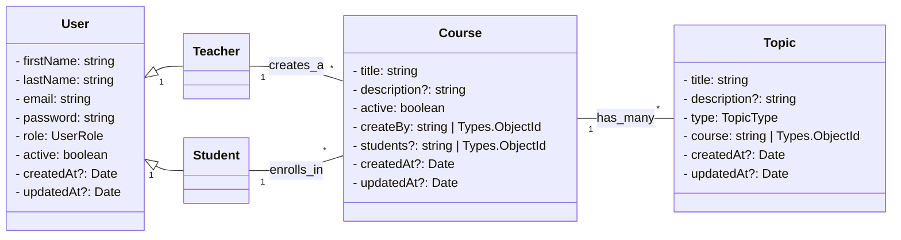

# Backend

## Descrição

O **backend** do Sistema de Atividades Escolares é responsável por fornecer a API da aplicação, implementada em **Node.js** com **TypeScript**. Ele utiliza **MongoDB** como banco de dados e **JWT** para autenticação. Entre suas funcionalidades estão:

* Gerenciamento de usuários (professores e alunos)
* Autenticação e autorização
* Gestão de cursos e tópicos
* Estrutura modular para fácil manutenção e expansão

---

## Diagrama de Classes



---

## Estrutura do projeto

```bash
backend/
 ├─ src/
 │   ├─ index.ts                   # Ponto de entrada da aplicação (inicia servidor)
 │   ├─ routes/                    # Contém os arquivos de rotas da API
 │   ├─ controllers/               # Lógica das rotas (controllers com classes)
 │   ├─ services/                  # Serviços que lidam com a lógica de negócio
 │   ├─ models/                    # Modelos do banco de dados (Mongoose)
 │   │    └─ enums/                # Enums para os modelos
 │   │    └─ interfaces/           # Interfaces TypeScript para os modelos
 │   ├─ dtos/                      # Data Transfer Objects para validação e respostas
 │   │    ├─ auth/                 # DTOs de autenticação (login, registro)
 │   │    └─ course/               # DTOs de cursos (resposta, update, etc.)
 │   │    └─ user/                 # DTOs de usuário (resposta, update, etc.)
 │   ├─ middlewares/               # Middlewares da aplicação (auth, validação, etc.)
 │   └─ config/                    # Configurações do projeto (DB, env, etc.)
 ├─ .env                           # Variáveis de ambiente reais (não versionar)
 ├─ .env.example                   # Exemplo de variáveis de ambiente
 ├─ .gitignore                     # Ignorar node_modules, dist, .env etc
 ├─ .dockerignore                  # Ignorar arquivos desnecessários no build
 ├─ Dockerfile                     # Dockerfile da API
 ├─ docker-compose.yml             # Orquestração com MongoDB
 ├─ package.json                   # Dependências e scripts do Node.js
 └─ tsconfig.json                  # Configuração do TypeScript
```

---

## Tecnologias Utilizadas

* **Node.js** + **TypeScript**
* **MongoDB**
* **JWT** para autenticação
* **Docker** e **Docker Compose** para execução em containers

---

## Instalação e Execução

Você pode rodar o backend de duas formas: **diretamente no Node.js** ou **via Docker Compose** (recomendado).

### 1. Clonando do GitHub

```bash
git clone https://github.com/seu-usuario/sistema_de_atividades_escolares.git
cd sistema_de_atividades_escolares/backend
```

### 2. Executando com Docker Compose (recomendado)

O Docker Compose já orquestra o backend e o MongoDB juntos:

```bash
# No diretório backend
docker-compose -p school-api up -d --build
```

**O que acontece:**

* Um container com MongoDB na porta `27017`
* Um container com a API backend na porta `3000`

Verifique se os containers estão rodando:

```bash
docker container ls
```

Para parar e remover os containers:

```bash
docker-compose -p school-api down
```

### 3. Executando localmente (sem Docker)

1. Instale as dependências:

```bash
npm install
```

2. Configure seu arquivo `.env` baseado em `.env.example`.
3. Inicie o servidor:

```bash
npm run dev
```

O backend estará disponível em: [http://localhost:3000](http://localhost:3000)

---