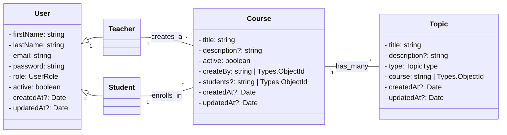

# Backend

## Descrição
Este projeto é o backend de um Sistema de Atividades Escolares, desenvolvido em TypeScript com Node.js, utilizando MongoDB como banco de dados e JWT para autenticação. Ele permite o gerenciamento de usuários, autenticação e outras funcionalidades relacionadas ao sistema escolar.

## Diagrama de Classes




## Estrutura do projeto

```bash
backend/
 ├─ src/
 │   ├─ index.ts                   # Ponto de entrada da aplicação (inicia servidor)
 │   ├─ routes/                    # Contém os arquivos de rotas da API
 │   ├─ controllers/               # Lógica das rotas (controllers com classes)
 │   ├─ services/                  # Serviços que lidam com a lógica de negócio
 │   ├─ models/                    # Modelos do banco de dados (Mongoose)
 │   │    └─ enums/                # Enums para os modelos
 │   │    └─ interfaces/           # Interfaces TypeScript para os modelos
 │   ├─ dtos/                      # Data Transfer Objects para validação e respostas
 │   │    ├─ auth/                 # DTOs de autenticação (login, registro)
 │   │    └─ course/               # DTOs de cursos (resposta, update, etc.)
 │   │    └─ user/                 # DTOs de usuário (resposta, update, etc.)
 │   ├─ middlewares/               # Middlewares da aplicação (auth, validação, etc.)
 │   └─ config/                    # Configurações do projeto (DB, env, etc.)
 ├─ .env                           # Variáveis de ambiente reais (não versionar)
 ├─ .env.example                   # Exemplo de variáveis de ambiente
 ├─ .gitignore                     # Ignorar node_modules, dist, .env etc
 ├─ .dockerignore                  # Ignorar arquivos desnecessários no build
 ├─ Dockerfile                     # Dockerfile da API
 ├─ docker-compose.yml             # Orquestração com MongoDB
 ├─ package.json                   # Dependências e scripts do Node.js
 └─ tsconfig.json                  # Configuração do TypeScript
```